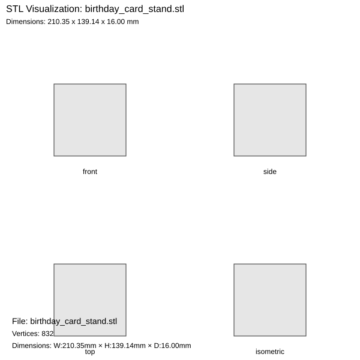

# 3D Printing Projects

This folder contains OpenSCAD (.scad) files for 3D printing projects designed for Bambu Lab A1.

> **No local software needed!** View STL files directly in your browser — GitHub renders them interactively in 3D. See the [☁️ Cloud Workflow](#️-cloud-workflow-no-local-software-needed) section below.

## 📁 Project Files

### 1. **fintech_ai_nameplate.scad** / **.stl** / **.3mf**
- **Description**: Professional nameplate with "FINTECH × AI" text
- **Dimensions**: 250×85×4.6mm (large desktop nameplate)
- **Features**:
  - Efficient 2-color printing (black base + blue text)
  - One filament change at 3mm height
  - Large 24mm fonts for maximum impact
- **Print Time**: ~75 minutes
- **Material**: ~$2.50

### 2. **birthday_card_stand.scad** / **.stl**
- **Description**: Foldable display stand for a multi-panel birthday card (family gift)
- **Dimensions (flat)**: ~210×139×16mm — fits Bambu A1 256×256mm bed
- **Card Sizes Supported**:
  - Center panel: 4.25″ × 5.5″
  - Top/bottom flaps: 4.25″ × 2.625″ each
  - Left/right flaps: 2″ × 5.5″ each
- **Features**:
  - **Living hinges** — prints flat as a cross shape, folds into a display cradle
  - U-channel grooves hold each card panel in place
  - No supports required; prints flat on the bed
  - Angle-stop brackets keep wings at 45°
- **Print Time**: ~2–3 hours
- **Material**: White PLA, ~40g
- **Printer**: Bambu Lab A1
- **Preview**: 

## ☁️ Cloud Workflow (No Local Software Needed)

You don't need OpenSCAD or Bambu Studio installed locally to view or work with these files.

### Option 1: View STL in GitHub (Recommended — Zero Setup)
GitHub renders `.stl` files interactively in your browser:
1. Open the repository on GitHub.com
2. Click on any `.stl` file (e.g., [`birthday_card_stand.stl`](birthday_card_stand.stl))
3. GitHub shows an interactive 3D viewer — rotate, zoom, and inspect the model
4. No installation required!

### Option 2: Online STL Viewer
Upload the `.stl` file to a free online viewer:
- **[3dviewer.net](https://3dviewer.net)** — drag and drop any STL/3MF file
- **[viewstl.com](https://www.viewstl.com)** — simple browser-based viewer
- **[Autodesk Viewer](https://viewer.autodesk.com)** — supports many formats including STL and 3MF

### Option 3: Edit OpenSCAD in the Cloud
Modify the `.scad` parametric source files without installing anything:
- **[Omnia OpenSCAD](https://openscad.cloud)** — paste or upload `.scad` files and render in-browser
- **GitHub Codespaces** — open this repo in a Codespace and run OpenSCAD headless to export STL:
  ```bash
  openscad --export-format binstl -o birthday_card_stand.stl birthday_card_stand.scad
  ```

### Option 4: Upload STL to Bambu Cloud (MakerWorld)
1. Go to [makerworld.com](https://makerworld.com)
2. Upload the `.stl` or `.3mf` file directly
3. Slice and send to your Bambu Lab A1 from the browser

## 🖥️ Local OpenSCAD (Optional)

If you prefer to install OpenSCAD locally:

### Windows
```powershell
# Open a .scad file
& "C:\Users\<YourName>\Downloads\openscad-2021.01\openscad.exe" "birthday_card_stand.scad"
```

### macOS / Linux
```bash
openscad birthday_card_stand.scad
```

### File Association (One-time setup)
1. Right-click any `.scad` file → "Open with" → "Choose another app"
2. Browse to `openscad.exe` (Windows) or `OpenSCAD.app` (macOS)
3. Check "Always use this app" — future double-clicks open directly

## 📋 OpenSCAD Workflow

### 1. Preview (F5)
- Fast preview of the design
- Good for adjusting parameters
- Colors show different parts

### 2. Render (F6)
- Full geometry calculation
- Required before STL export
- Takes longer but more accurate

### 3. Export STL
- File → Export → Export as STL
- Save to same folder
- Import STL into Bambu Studio or upload to cloud

## 🖨️ Bambu Studio / Cloud Slicer Settings

### General Settings (Bambu Lab A1):
- **Layer Height**: 0.2mm (0.15mm for fine details)
- **Infill**: 15-20%
- **Print Speed**: Normal/Standard
- **Supports**: Usually none needed

### Birthday Card Stand Specific:
- **Material**: White PLA
- **Layer Height**: 0.2mm
- **Infill**: 20% grid
- **Supports**: NONE (prints flat)
- **Bed Adhesion**: Brim recommended
- **After Printing**: Gently fold along living hinges:
  1. Fold center support up 90° from base
  2. Fold left/right wings to 45° outward
  3. Fold top rail to continue center vertically
  4. Slide card panels into grooves

### Multi-Color Setup:
1. Import STL into Bambu Studio
2. Use "Change Filament" for height-based colors
3. Or use "Paint" tool for geometry-based colors
4. Set up AMS filament sequence

## 🔌 MCP Server Setup (VS Code + Bambu Lab A1)

The repository includes a VS Code MCP (Model Context Protocol) configuration to control the printer directly from the editor.

### Setup
1. Install the server globally:
   ```bash
   npm install -g mcp-3d-printer-server
   ```
2. Find your Bambu Lab A1 credentials:
   - **Printer IP**: Check your router's device list, or open Bambu Studio → Device tab
   - **Serial number**: Printed on the label on the back of the printer
   - **Access token**: Bambu Studio → Device → Settings → Local LAN Mode
3. Copy `.vscode/mcp.json` to `.vscode/mcp.local.json` and fill in your real values:
   ```json
   {
     "servers": {
       "3dprint": {
         "command": "mcp-3d-printer-server",
         "env": {
           "PRINTER_TYPE": "bambu",
           "PRINTER_HOST": "192.168.x.x",
           "BAMBU_SERIAL": "YOUR_SERIAL",
           "BAMBU_TOKEN": "YOUR_TOKEN"
         }
       }
     }
   }
   ```
> ⚠️ **Security**: `.vscode/mcp.local.json` is listed in `.gitignore` and will never be committed. **Never edit or commit the credentials in `.vscode/mcp.json`** — it contains only placeholder values.

## 🔧 Troubleshooting

### If STL export fails in OpenSCAD:
- Press F6 first (full render)
- Check for error messages in console
- Reduce `$fn` value if too complex

### If living hinges break after printing:
- The hinges are designed to flex; if one breaks, glue at desired angle
- Test print: Export just a 20mm groove strip first to verify card fit

### If the model doesn't fit on the bed:
- Check console output: the `.scad` file prints bed-fit status on every render
- Adjust `center_rail_h` or `base_depth` parameters to scale down

## 📂 Repository Structure

```
3D-Printing/
├── birthday_card_stand.scad          # Parametric source (edit parameters here)
├── birthday_card_stand.stl           # Ready-to-print export
├── birthday_card_stand_visualization.svg  # Flat layout diagram
├── fintech_ai_nameplate.scad         # Parametric source
├── fintech_ai_nameplate.stl          # Ready-to-print export
├── fintech_ai_nameplate.3mf          # Bambu Studio project file
└── README.md
```

## 💡 Tips

- Keep `.scad` files in this folder for version control
- Export `.stl` files to the same folder
- Use descriptive filenames for variations
- Comment your parameter changes in the code
- Test print small versions first for fit checks
- **GitHub renders `.stl` files in 3D** — click any `.stl` in the repo to preview it

---
*Last Updated: March 2026*
*Compatible with: OpenSCAD 2021.01+, Bambu Lab A1*
